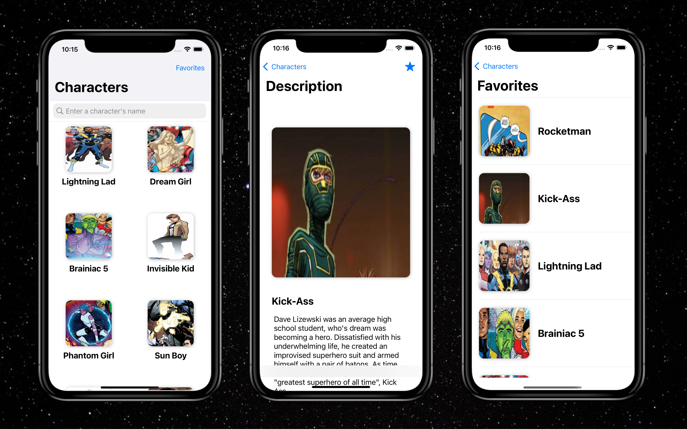

# ComicVineApp

Test Project for VK Internship

## Screenshots

## Description

This is my solution for the test project to get an Internship at VK.
Master-Detail app with pagination and some additional featutes.
Build completely on Swift, without any libraries.
By the way, using UIKit.

### Features
- CollectionView as the Main Screen
- Build on MVVM architecture
- Reusable Networking layer
- Pagination
- Storyboards
- No libararies
- Supporting the Dark Theme
- Handle of no Internet Connection
- Caching of Images
